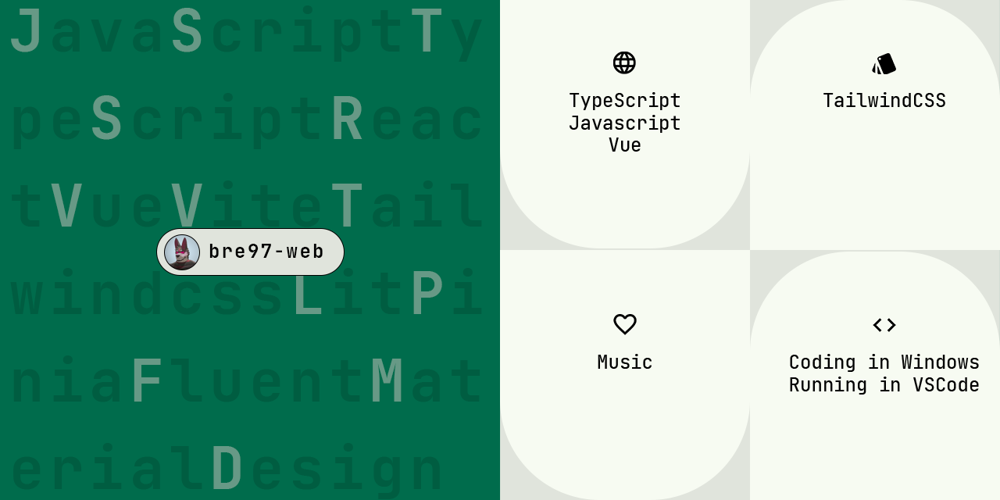

## Hello GitHub :smile:

Not long after I came into contact with front-end technology, I opened some simple static web pages to GitHub as toys. Commit a branch to me if you want to contribute, welcome!

:sunglasses: Hello everyone, I am bre97-web, you can call me bre. 

:dart: My technology stack：
- HTML
- CSS
  - **TailwindCSS**
  - **Material web components**
  - Fluent web components
- Javascript
  - **Typescript**
  - **Vue**
- Databases
  - MySQL
  - MongoDB
- Other languages
  - Java

